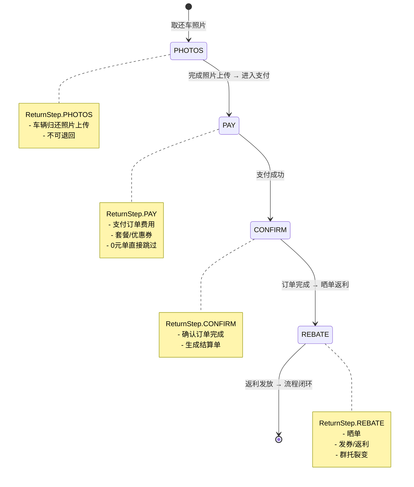

👌 来，直接给你一份 **Markdown 状态机图**，用 Mermaid 表达。你可以直接贴到文档或支持 Mermaid 的编辑器里（如 Typora、GitHub、蓝湖文档）就能渲染：

````markdown
# 分时租赁还车流程状态机（只进不退）



---

### 📌 说明
- **状态顺序**：PHOTOS → PAY → CONFIRM → REBATE  
- **守卫原则**：只进不退（`Math.max(localStep, serverStep)`）  
- **扩展点**：你现在只实现到 CONFIRM，可以加上 REBATE，让“晒单返利”也成为流程闭环的一部分。  

要不要我再帮你把 **守卫代码片段**也补上对 `REBATE` 的支持（`mapServerToStep` + 路由跳转），这样和这个图完全对应？
```
